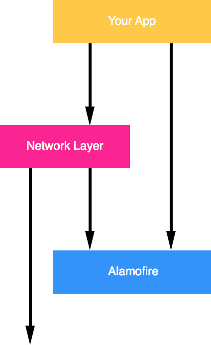
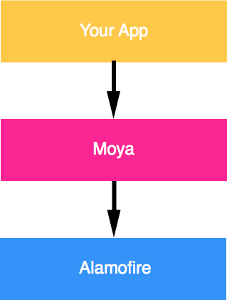

[](https://circleci.com/gh/ashfurrow/Moya)


You're a smart developer. You probably use Alamofire to abstract away access to
NSURLSession and all those nasty details you don't really care about. But then,
like lots of smart developers, you write ad hoc network abstraction layers. They
are probably called "APIManager" or "NetworkModel", and probably look something 
like this. 



It's leaky, meaning your app touches Alamofire directly and your layer bypasses
Alamofire to access the network directly sometimes. 

This kind of ad hoc network layer is common in iOS apps. It's bad for a few reasons:

- It makes it hard to write new apps ("where do I begin?")
- It makes it hard to maintain existing apps ("oh my god, this mess...")
- It makes it hard to write unit tests ("how do I do this again?")

So the basic idea is that we want some network abstraction layer that sufficiently
encapsulates actually calling Alamofire directly. It should be simple enough that
common things are easy, but comprehensive enough that complicated things are also
easy.



Basically:

> If you use Alamofire to abstract away `NSURLSession`, why not use something
to abstract away the nitty gritty of URLs, parameters, etc?

Some awesome features of Moya:

- Compile-time checking for correct API endpoint accesses.
- Lets you define a clear usage of different endpoints with associated enum values.
- Keeps track of inflight requests with ReactiveCocoa and prevents duplicate requests.
- Treats test stubs as first-class citizens so unit testing is super-easy.

Sample Project
--------------

There's a sample project in the Demo directory. Go nuts!

Project Status
--------------

This project has hit a 1.0 release, and we're using it in [Artsy's
new auction app](https://github.com/Artsy/eidolon). We consider it
ready for production use. 

Currently, we support Xcode 6.3.1 and Swift 1.2.

Installation
------------

Just add `pod 'Moya'` to your Podfile and go!

In any file you'd like to use Moya in, don't forget to
import the framework with `import Moya`.

For reactive extensions, this project has some dependencies. Add the following 
lines to your Podfile:

```rb
pod 'Moya'

# Include the following only if you want to use ReactiveCocoa extensions with Moya
pod 'ReactiveCocoa', '3.0.0-beta.6'
pod 'Moya/Reactive'
```

Then run `pod install`. 

Use
---

After some setup, using Moya is really simple. You can access an API like this:

```swift
provider.request(.Zen) { (data, statusCode, response, error) in
    if let data = data {
        // do something with the data
    }
}
```

That's a basic example. Many API requests need parameters. Moya encodes these
into the enum you use to access the endpoint, like this:

```swift
provider.request(.UserProfile("ashfurrow")) { (data, statusCode, response, error) in
    if let data = data {
        // do something with the data
    }
}
```

No more typos in URLs. No more missing parameter values. No more messing with
parameter encoding.

For more examples, see the [documentation](docs/).

ReactiveCocoa Extensions
------------------------

Even cooler are the ReactiveCocoa extensions. It immediately returns a  
`RACSignal` that you can subscribe to or bind or map or whatever you want to
do. To handle errors, for instance, we could do the following:

```swift
provider.request(.UserProfile("ashfurrow")).subscribeNext { (object) -> Void in
    image = UIImage(data: object as? NSData)
}, error: { (error) -> Void in
    println(error)
}
```

In addition to the option of using signals instead of callback blocks, there are
also a series of signal operators that will attempt to map the data received 
from the network response into either an image, some JSON, or a string, with 
`mapImage()`, `mapJSON()`, and `mapString()`, respectively. If the mapping is
unsuccessful, you'll get an error on the signal. You also get handy methods for
filtering out certain status codes. This means that you can place your code for 
handling API errors like 400's in the same places as code for handling invalid 
responses. 

License
-------

Moya is released under an MIT license. See LICENSE for more information.
