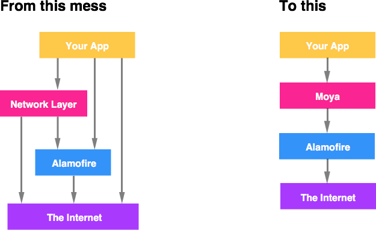

<p align="center">
  
</p>

# Moya 14.0.0-beta.5

[](https://circleci.com/gh/Moya/Moya/tree/master)
[](https://codecov.io/github/Moya/Moya?branch=master)
[](https://github.com/Carthage/Carthage)
[](https://github.com/JamitLabs/Accio)
[](https://cocoapods.org/pods/Moya)
[](https://github.com/apple/swift-package-manager)

*A Chinese version of this document can be found [here](https://github.com/Moya/Moya/blob/master/Readme_CN.md).*

You're a smart developer. You probably use [Alamofire](https://github.com/Alamofire/Alamofire) to abstract away access to
`URLSession` and all those nasty details you don't really care about. But then,
like lots of smart developers, you write ad hoc network abstraction layers. They
are probably called "APIManager" or "NetworkModel", and they always end in tears.



Ad hoc network layers are common in iOS apps. They're bad for a few reasons:

- Makes it hard to write new apps ("where do I begin?")
- Makes it hard to maintain existing apps ("oh my god, this mess...")
- Makes it hard to write unit tests ("how do I do this again?")

So the basic idea of Moya is that we want some network abstraction layer that
sufficiently encapsulates actually calling Alamofire directly. It should be simple
enough that common things are easy, but comprehensive enough that complicated things
are also easy.

> If you use Alamofire to abstract away `URLSession`, why not use something
to abstract away the nitty gritty of URLs, parameters, etc?

Some awesome features of Moya:

- Compile-time checking for correct API endpoint accesses.
- Lets you define a clear usage of different endpoints with associated enum values.
- Treats test stubs as first-class citizens so unit testing is super-easy.

You can check out more about the project direction in the [vision document](https://github.com/Moya/Moya/blob/master/Vision.md).

## Sample Projects

We have provided two sample projects in the repository. To use it download the repo, run `carthage update` to download the required libraries and  open [Moya.xcodeproj](https://github.com/Moya/Moya/tree/master/Moya.xcodeproj). You'll see two schemes: `Basic` and `Multi-Target` - select one and then build & run! Source files for these are in the `Examples` directory in project navigator. Have fun!

## Project Status

This project is actively under development, and is being used in [Artsy's
new auction app](https://github.com/Artsy/eidolon). We consider it
ready for production use.

## Installation

### Moya version vs Swift version.

Below is a table that shows which version of Moya you should use for
your Swift version.

| Swift | Moya           | RxMoya          | ReactiveMoya   |
| ----- | -------------- |---------------- |--------------- |
| 5.X   | >= 13.0.0      | >= 13.0.0       | >= 13.0.0      |
| 4.X   | 9.0.0 - 12.0.1 | 10.0.0 - 12.0.1 | 9.0.0 - 12.0.1 |
| 3.X   | 8.0.0 - 8.0.5  | 8.0.0 - 8.0.5   | 8.0.0 - 8.0.5  |
| 2.3   | 7.0.2 - 7.0.4  | 7.0.2 - 7.0.4   | 7.0.2 - 7.0.4  |
| 2.2   | <= 7.0.1       | <= 7.0.1        | <= 7.0.1       |

_Note: If you are using Swift 4.2 in your project, but you are using Xcode 10.2, Moya 13 should work correctly even though we use Swift 5.0._

**Upgrading to a new major version of Moya? Check out our [migration guides](https://github.com/Moya/Moya/blob/master/docs/MigrationGuides).**

### Swift Package Manager

To integrate using Apple's Swift package manager, add the following as a dependency to your `Package.swift`:

```swift
.package(url: "https://github.com/Moya/Moya.git", .upToNextMajor(from: "14.0.0"))
```

and then specify `"Moya"` as a dependency of the Target in which you wish to use Moya.
If you want to use reactive extensions, add also `"ReactiveMoya"` or `"RxMoya"` as your Target dependency respectively.
Here's an example `PackageDescription`:

```swift
// swift-tools-version:5.0
import PackageDescription

let package = Package(
    name: "MyPackage",
    products: [
        .library(
            name: "MyPackage",
            targets: ["MyPackage"]),
    ],
    dependencies: [
        .package(url: "https://github.com/Moya/Moya.git", .upToNextMajor(from: "14.0.0"))
    ],
    targets: [
        .target(
            name: "MyPackage",
            dependencies: ["ReactiveMoya"])
    ]
)
```

Note: If you are using **ReactiveMoya**, we are using [our own fork of ReactiveSwift](https://github.com/Moya/ReactiveSwift). This fork adds 2 commits to remove testing dependencies on releases (starting 6.1.0). This is to prevent Xcode Previews on Xcode 11/11.1 to build testing dependencies (FB7316430). If you don't want to use our fork, you can just add another dependency to your SPM package list: `git@github.com:ReactiveCocoa/ReactiveSwift.git` and it should fetch the original repository.

### Accio

[Accio](https://github.com/JamitLabs/Accio) is a dependency manager based on SwiftPM which can build frameworks for iOS/macOS/tvOS/watchOS. Therefore the integration steps of Moya are exactly the same as described above. Once your `Package.swift` file is configured, run `accio update` instead of `swift package update`.

### CocoaPods

For Moya, use the following entry in your Podfile:

```rb
pod 'Moya', '~> 14.0'

# or 

pod 'Moya/RxSwift', '~> 14.0'

# or

pod 'Moya/ReactiveSwift', '~> 14.0'
```

Then run `pod install`.

In any file you'd like to use Moya in, don't forget to
import the framework with `import Moya`.

### Carthage

Carthage users can point to this repository and use whichever
generated framework they'd like, `Moya`, `RxMoya`, or `ReactiveMoya`.

Make the following entry in your Cartfile:

```
github "Moya/Moya" ~> 14.0
```

Then run `carthage update`.

If this is your first time using Carthage in the project, you'll need to go through some additional steps as explained [over at Carthage](https://github.com/Carthage/Carthage#adding-frameworks-to-an-application).

> NOTE: At this time, Carthage does not provide a way to build only specific repository submodules. All submodules and their dependencies will be built with the above command. However, you don't need to copy frameworks you aren't using into your project. For instance, if you aren't using `ReactiveSwift`, feel free to delete that framework along with `ReactiveMoya` from the Carthage Build directory after `carthage update` completes. Or if you are using `ReactiveSwift` but not `RxSwift`, then `RxMoya`, `RxTest`, `RxCocoa`, etc. can safely be deleted.

### Manually

- Open up Terminal, `cd` into your top-level project directory, and run the following command *if* your project is not initialized as a git repository:

```bash
$ git init
```

- Add Alamofire, Result & Moya as a git [submodule](http://git-scm.com/docs/git-submodule) by running the following commands:

```bash
$ git submodule add https://github.com/Alamofire/Alamofire.git
$ git submodule add https://github.com/antitypical/Result.git
$ git submodule add https://github.com/Moya/Moya.git
```

- Open the new `Alamofire` folder, and drag the `Alamofire.xcodeproj` into the Project Navigator of your application's Xcode project. Do the same with the `Result.xcodeproj` in the `Result` folder and `Moya.xcodeproj` in the `Moya` folder.

> They should appear nested underneath your application's blue project icon. Whether it is above or below all the other Xcode groups does not matter.

- Verify that the deployment targets of the `xcodeproj`s match that of your application target in the Project Navigator.
- Next, select your application project in the Project Navigator (blue project icon) to navigate to the target configuration window and select the application target under the "Targets" heading in the sidebar.
- In the tab bar at the top of that window, open the "General" panel.
- Click on the `+` button under the "Embedded Binaries" section.
- You will see two different `Alamofire.xcodeproj` folders each with two different versions of the `Alamofire.framework` nested inside a `Products` folder.

> It does not matter which `Products` folder you choose from, but it does matter whether you choose the top or bottom `Alamofire.framework`.

- Select the top `Alamofire.framework` for iOS and the bottom one for macOS.

> You can verify which one you selected by inspecting the build log for your project. The build target for `Alamofire` will be listed as either `Alamofire iOS`, `Alamofire macOS`, `Alamofire tvOS` or `Alamofire watchOS`.

- Click on the `+` button under "Embedded Binaries" again and add the build target you need for `Result`.
- Click on the `+` button again and add the correct build target for `Moya`.

- And that's it!

> The three frameworks are automagically added as a target dependency, linked framework and embedded framework in a copy files build phase which is all you need to build on the simulator and a device.

## Usage

After [some setup](https://github.com/Moya/Moya/blob/master/docs/Examples/Basic.md), using Moya is really simple. You can access an API like this:

```swift
provider = MoyaProvider<GitHub>()
provider.request(.zen) { result in
    switch result {
    case let .success(moyaResponse):
        let data = moyaResponse.data
        let statusCode = moyaResponse.statusCode
        // do something with the response data or statusCode
    case let .failure(error):
        // this means there was a network failure - either the request
        // wasn't sent (connectivity), or no response was received (server
        // timed out).  If the server responds with a 4xx or 5xx error, that
        // will be sent as a ".success"-ful response.
    }
}
```

That's a basic example. Many API requests need parameters. Moya encodes these
into the enum you use to access the endpoint, like this:

```swift
provider = MoyaProvider<GitHub>()
provider.request(.userProfile("ashfurrow")) { result in
    // do something with the result
}
```

No more typos in URLs. No more missing parameter values. No more messing with
parameter encoding.

For more examples, see the [documentation](https://github.com/Moya/Moya/blob/master/docs/Examples).

## Reactive Extensions

Even cooler are the reactive extensions. Moya provides reactive extensions for
[ReactiveSwift](https://github.com/ReactiveCocoa/ReactiveSwift) and
[RxSwift](https://github.com/ReactiveX/RxSwift).

### ReactiveSwift

[`ReactiveSwift` extension](https://github.com/Moya/Moya/blob/master/docs/ReactiveSwift.md) provides both `reactive.request(:callbackQueue:)` and 
`reactive.requestWithProgress(:callbackQueue:)` methods that immediately return
`SignalProducer`s that you can start, bind, map, or whatever you want to do.
To handle errors, for instance, we could do the following:

```swift
provider = MoyaProvider<GitHub>()
provider.reactive.request(.userProfile("ashfurrow")).start { event in
    switch event {
    case let .value(response):
        image = UIImage(data: response.data)
    case let .failed(error):
        print(error)
    default:
        break
    }
}
```

### RxSwift

[`RxSwift` extension](https://github.com/Moya/Moya/blob/master/docs/RxSwift.md) also provide both `rx.request(:callbackQueue:)` and
`rx.requestWithProgress(:callbackQueue:)` methods, but return type is
different for both. In case of a normal `rx.request(:callbackQueue)`, the
return type is `Single<Response>` which emits either single element or an
error. In case of a `rx.requestWithProgress(:callbackQueue:)`, the return 
type is `Observable<ProgressResponse>`, since we may get multiple events
from progress and one last event which is a response.

To handle errors, for instance, we could do the following:

```swift
provider = MoyaProvider<GitHub>()
provider.rx.request(.userProfile("ashfurrow")).subscribe { event in
    switch event {
    case let .success(response):
        image = UIImage(data: response.data)
    case let .error(error):
        print(error)
    }
}
```

In addition to the option of using signals instead of callback blocks, there are
also a series of signal operators for RxSwift and ReactiveSwift that will attempt
to map the data received from the network response into either an image, some JSON,
or a string, with `mapImage()`, `mapJSON()`, and `mapString()`, respectively. If the mapping is unsuccessful, you'll get an error on the signal. You also get handy methods
for filtering out certain status codes. This means that you can place your code for
handling API errors like 400's in the same places as code for handling invalid
responses.

## Community Projects

[Moya has a great community around it and some people have created some very helpful extensions](https://github.com/Moya/Moya/blob/master/docs/CommunityProjects.md).

## Contributing

Hey! Do you like Moya? Awesome! We could actually really use your help!

Open source isn't just writing code. Moya could use your help with any of the
following:

- Finding (and reporting!) bugs.
- New feature suggestions.
- Answering questions on issues.
- Documentation improvements.
- Reviewing pull requests.
- Helping to manage issue priorities.
- Fixing bugs/new features.

If any of that sounds cool to you, send a pull request! After your first
contribution, we will add you as a member to the repo so you can merge pull
requests and help steer the ship :ship: You can read more details about that [in our contributor guidelines](https://github.com/Moya/Moya/blob/master/Contributing.md).

Moya's community has a tremendous positive energy, and the maintainers are committed to keeping things awesome. Like [in the CocoaPods community](https://github.com/CocoaPods/CocoaPods/wiki/Communication-&-Design-Rules), always assume positive intent; even if a comment sounds mean-spirited, give the person the benefit of the doubt.

Please note that this project is released with a Contributor Code of Conduct. By participating in this project you agree to abide by [its terms](https://github.com/Moya/Moya/blob/master/Code%20of%20Conduct.md).

### Adding new source files

If you add or remove a source file from Moya, a corresponding change needs to be made to the `Moya.xcodeproj` project at the root of this repository. This project is used for Carthage. Don't worry, you'll get an automated warning when submitting a pull request if you forget.

### Help us improve Moya documentation
Whether you’re a core member or a user trying it out for the first time, you can make a valuable contribution to Moya by improving the documentation. Help us by:

- sending us feedback about something you thought was confusing or simply missing
- suggesting better wording or ways of explaining certain topics
- sending us a pull request via GitHub
- improving the [Chinese documentation](https://github.com/Moya/Moya/blob/master/Readme_CN.md)


## License

Moya is released under an MIT license. See [License.md](https://github.com/Moya/Moya/blob/master/License.md) for more information.
