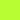
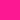
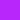

# Design

Here're the rasterized versions of the image assets used by Moya.

## Colours

|                                                               | Hex     | Colour |
|---------------------------------------------------------------|---------|--------|
|  | #FEC937 | Yellow |
|    | #2C90FB | Blue   |
|   | #B8FD33 | Green  |
|    | #FC1892 | Pink   |
|  | #B826FB | Purple |

## Logo

## Documentation Images

