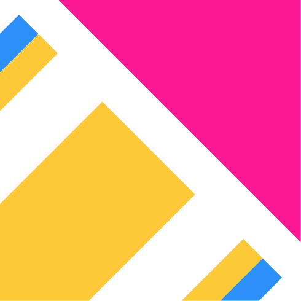

# Design

Here're the rasterized versions of the image assets used by Moya.

## Colours

|   | Hex | Colour |
|---|-----|--------|
| <svg width="20" height="20"> <rect width="20" height="20" style="fill:#FEC937;" /></svg> | #FEC937 | Yellow |
| <svg width="20" height="20"> <rect width="20" height="20" style="fill:#2C90FB;" /></svg> | #2C90FB | Blue |
| <svg width="20" height="20"> <rect width="20" height="20" style="fill:#B8FD33;" /></svg> | #B8FD33 | Green |
| <svg width="20" height="20"> <rect width="20" height="20" style="fill:#FC1892;" /></svg> | #FC1892 | Pink |
| <svg width="20" height="20"> <rect width="20" height="20" style="fill:#B826FB;" /></svg> | #B826FB | Purple |

## Logo

## Documentation Images

